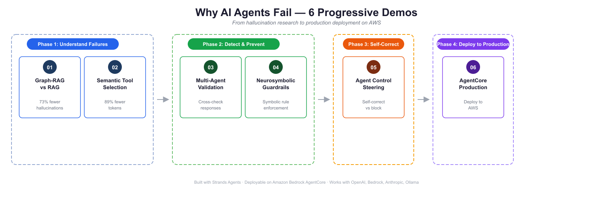

# How to Stop AI Agent Hallucinations: 5 Techniques + Production on Amazon Bedrock AgentCore

[](https://python.org)
[](https://strandsagents.com)
[](https://aws.amazon.com/bedrock/)
[](https://neo4j.com)
[](LICENSE)
[]()

**AI agent hallucinations** occur when agents fabricate statistics, pick wrong tools, ignore business rules, or claim success when operations fail. This workshop provides 5 hands-on techniques — Graph-RAG, semantic tool selection, multi-agent validation, neurosymbolic guardrails, and agent steering — plus a production deployment demo on Amazon Bedrock AgentCore.

> Based on the Dev.to series [Stop AI Agent Hallucinations: 4 Essential Techniques](https://dev.to/aws/stop-ai-agent-hallucinations-4-essential-techniques-2i94) and [5 Techniques to Stop AI Agent Hallucinations in Production](https://dev.to/aws/5-techniques-to-stop-ai-agent-hallucinations-in-production-oik).

Built with [Strands Agents](https://strandsagents.com) and Amazon Bedrock. The same patterns apply in LangGraph, AutoGen, CrewAI, or any other agent framework.



---

## Graph-RAG vs. Standard RAG: Why It Matters for Hallucinations

| Approach | Hallucination Risk | Retrieval Method | Best For |
|---|---|---|---|
| Standard RAG (vector) | High — returns similar content even when irrelevant | Cosine similarity | General Q&A |
| Graph-RAG (Neo4j) | 73% lower — grounded in entity relationships | Graph traversal + Cypher | Structured domains (hotels, products, finance) |

> **Key insight:** Vector search always returns *something similar*, even when the answer doesn't exist in the database — causing fabrication. Graph-RAG returns only what's explicitly connected in the knowledge graph.

---

## What Does Each Demo Solve?

| # | Demo | What It Solves | Key Result | Stack |
|:-:|------|----------------|------------|-------|
| 01 | [Graph-RAG vs RAG](./01-graphrag-demo/) | Fabricated statistics, incomplete retrieval, out-of-domain hallucination | 73% fewer hallucinations with knowledge graphs |   |
| 02 | [Semantic Tool Selection](./02-semantic-tools-demo/) | Wrong tool picks, token waste at scale (29 tools) | 89% token reduction, higher accuracy |   |
| 03 | [Multi-Agent Validation](./03-multiagent-demo/) | Undetected hallucinations, fabricated responses | Executor-Validator-Critic cross-check pipeline |  |
| 04 | [Neurosymbolic Guardrails](./04-neurosymbolic-demo/) | Agents ignoring business rules in prompts | Symbolic rules enforced via lifecycle hooks |  |
| 05 | [Agent Control Steering](./05-steering-demo/) | Hard-blocking stops the task instead of fixing it | Agent self-corrects instead of failing |  |
| 06 | [Amazon Bedrock AgentCore](./06-agentcore-boto3-demo/) | Taking all 5 techniques to production on AWS | Hotel booking agent on Amazon Bedrock AgentCore with Lambda + DynamoDB |    |

---

## How Do the 6 Demos Build on Each Other?

Each demo builds on the previous one. You can run any demo independently, but the learning path is designed to be progressive:

**Phase 1 — Understand Failures:** Demos 01-02 show *why* agents fail — RAG hallucinations and tool selection errors backed by academic research.

**Phase 2 — Detect & Prevent:** Demos 03-04 show *how to catch* failures — multi-agent validation and symbolic rule enforcement.

**Phase 3 — Self-Correct:** Demo 05 shows *how to steer* agents to self-correct instead of blocking (Agent Control).

**Phase 4 — Deploy to Production:** Demo 06 shows *how to ship* all 5 techniques to production on AWS using Amazon Bedrock AgentCore, DynamoDB, and Lambda.

---

## How Do I Run These Demos?

### Prerequisites

- Python 3.9+
- [uv](https://docs.astral.sh/uv/) package manager
- AWS account with [Amazon Bedrock](https://aws.amazon.com/bedrock/) access (Claude Sonnet 4 enabled in your region)

### Run Any Demo

```bash
cd 01-graphrag-demo   # or any demo folder
uv venv && uv pip install -r requirements.txt

# Run the demo
uv run <main_script>.py
# Or open the .ipynb notebook in your IDE (VS Code, Kiro, or any editor with notebook support)
```

Each demo README has specific setup instructions and prerequisites.

### Neo4j Setup (Demo 01)

Demo 01 requires a Neo4j instance to build and query the knowledge graph.

**Running as part of a workshop:** A Neo4j Aura instance will be provided. You will receive the connection credentials (`NEO4J_URI`, `NEO4J_USERNAME`, `NEO4J_PASSWORD`) at the start of the session — add them to a `.env` file in `01-graphrag-demo/`.

**Running independently:** Create your own free Neo4j Aura instance:

1. Go to [console.neo4j.io](https://console.neo4j.io) and create a free **AuraDB** instance
2. Download the credentials file when prompted — it contains your URI, username, and password
3. Create a `.env` file in `01-graphrag-demo/`:
   ```
   NEO4J_URI=neo4j+s://<your-instance>.databases.neo4j.io
   NEO4J_USERNAME=neo4j
   NEO4J_PASSWORD=<your-password>
   ```
4. Enable the **APOC** plugin in your Aura instance settings
5. Run `build_graph_lite.py` (30 docs, ~15 min) or `build_graph.py` (300 docs, ~2 hours) to populate the graph

---

## Frequently Asked Questions

### What types of AI agent hallucinations does this repository address?

This repository addresses four main categories: **(1)** fabricated statistics — when RAG agents guess numbers instead of computing them, **(2)** wrong tool selection — when agents pick inappropriate tools from large toolsets, **(3)** business rule violations — when agents ignore constraints expressed only in prompts, and **(4)** undetected failures — when single agents claim success without validation.

### Can I use these patterns with frameworks other than Strands Agents?

Yes. The patterns (Graph-RAG, semantic tool filtering, multi-agent validation, neurosymbolic guardrails, steering controls) are framework-agnostic concepts. These demos use Strands Agents, but the same approaches apply in LangGraph, AutoGen, CrewAI, Haystack, or custom implementations. The key insight is architectural, not framework-specific.

### Do I need an AWS account to run the demos?

Yes. All demos use Amazon Bedrock (Claude Sonnet 4) as the default LLM provider. You need an AWS account with Bedrock access enabled in your region.

### How long does it take to run each demo?

Demos 02-05 run in under 5 minutes. Demo 01 has a lite mode (30 docs, ~15 minutes) and full mode (300 docs, ~2 hours) for building the knowledge graph.

### What LLM providers are supported?

All demos default to Amazon Bedrock (Claude Sonnet 4) but work with any provider supported by Strands Agents: Anthropic API, OpenAI, Ollama (local models), or any OpenAI-compatible endpoint. See [Strands Model Providers](https://strandsagents.com/docs/user-guide/concepts/model-providers/amazon-bedrock/) for configuration.

---

## Common Issues and How to Fix Them

**Bedrock access denied:** Ensure the model (`us.anthropic.claude-sonnet-4-5` or similar) is enabled in your region via the [Bedrock Model Access console](https://console.aws.amazon.com/bedrock/home#/modelaccess).

**Neo4j connection fails (demo 01):** Verify `NEO4J_URI`, `NEO4J_USERNAME`, and `NEO4J_PASSWORD` are set in your `.env` file and that APOC is enabled on your Aura instance.

**OpenTelemetry warnings:** "Failed to detach context" warnings in demos 03-05 are harmless and do not affect functionality.

**Model alternatives:** Change the model in any demo by modifying the `BedrockModel(model_id=...)` call. See [Strands Model Providers](https://strandsagents.com/docs/user-guide/concepts/model-providers/amazon-bedrock/) for all supported options.

For demo-specific issues, check the troubleshooting section in each demo's README.

---

## References

1. Fuentes, E. (2025). *Stop AI Agent Hallucinations: 4 Essential Techniques.* Dev.to / AWS. [dev.to/aws/stop-ai-agent-hallucinations-4-essential-techniques-2i94](https://dev.to/aws/stop-ai-agent-hallucinations-4-essential-techniques-2i94)
2. Fuentes, E. (2025). *5 Techniques to Stop AI Agent Hallucinations in Production.* Dev.to / AWS. [dev.to/aws/5-techniques-to-stop-ai-agent-hallucinations-in-production-oik](https://dev.to/aws/5-techniques-to-stop-ai-agent-hallucinations-in-production-oik)
3. Edge et al. (2024). *From Local to Global: A Graph RAG Approach to Query-Focused Summarization.* Microsoft Research. [arXiv:2404.16130](https://arxiv.org/abs/2404.16130)
4. AWS. *Reducing hallucinations in large language models with custom intervention using Amazon Bedrock Agents.* [AWS Blog](https://aws.amazon.com/blogs/machine-learning/reducing-hallucinations-in-large-language-models/)

---

## Contributing

Contributions are welcome! See [CONTRIBUTING](CONTRIBUTING.md) for more information.

---

## Security

If you discover a potential security issue in this project, notify AWS/Amazon Security via the [vulnerability reporting page](https://aws.amazon.com/security/vulnerability-reporting/). Please do **not** create a public GitHub issue.

---

## License

This library is licensed under the MIT-0 License. See the [LICENSE](LICENSE) file for details.

> Last updated: March 2026 | Strands Agents 1.27+ | Python 3.9+
